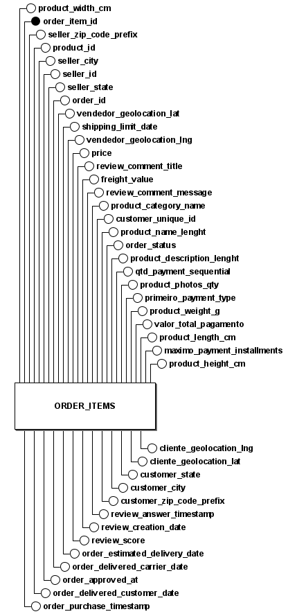

# MER & Dicionário de Dados — Camada Silver

Este documento descreve o Modelo Entidade-Relacionamento (MER) e o dicionário de dados da tabela única definida em `DDL.sql` na camada Silver. O DDL consolidou vários arquivos da camada Raw (orders, order_items, payments, reviews, customers, sellers, geolocation, product translation) em uma única tabela denormalizada chamada `ORDER_ITEMS` — um modelo típico de data lake / zone Silver para facilitar análises e consultas analíticas.

## Objetivo

- Ter uma única tabela denormalizada que traga, por item de pedido, atributos do pedido, do produto, do vendedor, do cliente, pagamentos, avaliações e geolocalizações.
- Facilitar análises agregadas e feature engineering sem múltiplos joins nas etapas iniciais do pipeline.

## Observações importantes sobre modelagem

- A tabela física no DDL chama-se `ORDER_ITEMS` e contém todas as colunas listadas no arquivo `DDL.sql`.
- No dataset Raw original a chave natural dos itens era composta (`order_id`, `order_item_id`). No DDL da Silver o `order_item_id` foi definido como PRIMARY KEY (inteiro). Isso implica que o `order_item_id` foi convertido para PK única para preserva unicidade.
- Várias colunas vêm de diferentes arquivos da camada Raw:
	- `orders`: timestamps e status
	- `order_items`: price, freight_value, shipping_limit_date, product_id, seller_id, order_id
	- `customers`: customer_unique_id, customer_zip_code_prefix, customer_city, customer_state
	- `sellers`: seller_zip_code_prefix, seller_city, seller_state
	- `payments`: qtd_payment_sequential, primeiro_payment_type, valor_total_pagamento, maximo_payment_installments
	- `order_reviews`: review_*
	- `geolocation`: geolocation lat/lng mesclados a seller/cliente

## MER - Modelo Entidade-Relacionamento

O Modelo Entidade-Relacionamento (MER) é uma abordagem conceitual utilizada no desenvolvimento de bancos de dados para representar entidades, seus atributos e os relacionamentos entre elas. Ele facilita a visualização da organização dos dados e da forma como as entidades interagem dentro do sistema de informações. O MER serve como a fundação conceitual para a criação dos Diagramas Entidade-Relacionamento (DER), que ilustram graficamente essa estrutura.

### Entidade

* ORDER_ITEMS

### Descrição das Entidades (Atributos)

* **ORDER_ITEMS&#x20;** (<ins>order_item_id<ins>, order_id, product_id, seller_id, shipping_limit_date, price, freight_value, product_category_name, product_name_lenght, product_description_lenght, product_photos_qty, product_weight_g, product_length_cm, product_height_cm, product_width_cm, seller_zip_code_prefix, seller_city, seller_state, vendedor_geolocation_lat, vendedor_geolocation_lng, review_comment_title, review_comment_message, customer_unique_id, order_status, qtd_payment_sequential, primeiro_payment_type, valor_total_pagamento, maximo_payment_installments, order_purchase_timestamp, order_delivered_customer_date, order_approved_at, order_delivered_carrier_date, order_estimated_delivery_date, review_score, review_creation_date, review_answer_timestamp, customer_zip_code_prefix, customer_city, customer_state, cliente_geolocation_lat, cliente_geolocation_lng)

## DER - Diagrama de Entidade e Relacionamento

O Diagrama Entidade-Relacionamento (DER) é uma representação visual empregada em projetos de bancos de dados. Ele ilustra as entidades (objetos), seus atributos (características) e os relacionamentos existentes entre elas. O DER é uma ferramenta essencial para visualizar e planejar a estrutura do banco de dados antes da implementação, auxiliando na definição de como os dados serão armazenados e acessados.

## DLD - Diagrama Lógico de Dados

O Diagrama Lógico de Dados (DLD) é uma representação gráfica que descreve a estrutura lógica de um banco de dados. Ele mostra detalhes importantes, como os tipos de atributos de cada entidade, além das chaves estrangeiras e restrições, como as chaves únicas (unique key). O principal objetivo do DLD é fornecer uma visão clara e estruturada de como o banco de dados deve ser projetado. Em síntese, o DLD serve como um guia visual para a implementação eficaz do banco de dados.

## Dicionário de Dados (coluna por coluna)

| Coluna | Tipo SQL | Nulo? | Descrição | Fonte / Observações |
|---|---:|---:|---|---|
| order_item_id | INTEGER PRIMARY KEY | NOT NULL | Identificador único do item (PK no Silver). | Origem: `order_items` — atenção: no raw era sequencial por `order_id`; aqui é chave única por linha. |
| product_id | INTEGER | NOT NULL | Identificador do produto. | Mapeado de `order_items.product_id`. No raw é UUID/string; aqui aparece como INTEGER no DDL — confirmar transformação/encoding. |
| seller_id | INTEGER | NOT NULL | Identificador do vendedor. | Mapeado de `order_items.seller_id`. Verificar encoding (raw UUID → inteiro?). |
| order_id | INTEGER | NOT NULL | Identificador do pedido. | `orders.order_id` no raw (UUID). Aqui é INTEGER — confirmar transformação. |
| shipping_limit_date | TIMESTAMP | NULLABLE | Prazo limite para envio informado pelo seller. | `order_items.shipping_limit_date` |
| price | DECIMAL(10,2) | NULLABLE | Preço do item (R$). | `order_items.price` |
| freight_value | DECIMAL(10,2) | NULLABLE | Valor do frete (R$). | `order_items.freight_value` |
| product_category_name | VARCHAR(255) | NULLABLE | Categoria do produto (pt). | Do produto (`products.product_category_name`), possivelmente traduzido/normalizado. |
| product_name_lenght | INTEGER | NULLABLE | Comprimento do nome do produto (nº caracteres). | `products.product_name_lenght` (observe o nome `lenght` no raw). |
| product_description_lenght | INTEGER | NULLABLE | Comprimento da descrição do produto. | `products.product_description_lenght` |
| product_photos_qty | INTEGER | NULLABLE | Quantidade de fotos do produto. | `products.product_photos_qty` |
| product_weight_g | DECIMAL(10,2) | NULLABLE | Peso do produto em gramas. | `products.product_weight_g` |
| product_length_cm | DECIMAL(10,2) | NULLABLE | Comprimento em cm. | `products.product_length_cm` |
| product_height_cm | DECIMAL(10,2) | NULLABLE | Altura em cm. | `products.product_height_cm` |
| product_width_cm | DECIMAL(10,2) | NULLABLE | Largura em cm. | `products.product_width_cm` |
| seller_zip_code_prefix | INTEGER | NULLABLE | Prefixo do CEP do vendedor (5 dígitos). | `sellers.seller_zip_code_prefix` |
| seller_city | VARCHAR(255) | NULLABLE | Cidade do vendedor. | `sellers.seller_city` |
| seller_state | VARCHAR(255) | NULLABLE | Estado (UF) do vendedor. | `sellers.seller_state` |
| vendedor_geolocation_lat | DECIMAL(9,6) | NULLABLE | Latitude do vendedor (derived de geolocation). | Nome renomeado no DDL; proveniente de `geolocation` casado por CEP. |
| vendedor_geolocation_lng | DECIMAL(9,6) | NULLABLE | Longitude do vendedor. | Mesma observação. |
| review_comment_title | VARCHAR(255) | NULLABLE | Título do comentário de review. | `order_reviews.review_comment_title` |
| review_comment_message | TEXT | NULLABLE | Mensagem do review. | `order_reviews.review_comment_message` |
| customer_unique_id | VARCHAR(255) | NOT NULL | Identificador único do cliente (permanente). | `customers.customer_unique_id` — chave de negócio para agregações por cliente. |
| order_status | VARCHAR(50) | NOT NULL | Status do pedido (delivered, shipped, canceled, ...). | `orders.order_status` |
| qtd_payment_sequential | INTEGER | NULLABLE | Quantidade sequencial de pagamentos associados ao pedido (maior sequencial). | Agregado a partir de `order_payments.payment_sequential` (ex: número de payments). |
| primeiro_payment_type | VARCHAR(50) | NULLABLE | Tipo do primeiro pagamento (credit_card, boleto, ...). | Extraído de `order_payments` onde `payment_sequential = 1`. |
| valor_total_pagamento | DECIMAL(10,2) | NULLABLE | Soma dos pagamentos do pedido (R$). | Soma de `order_payments.payment_value` por order_id. |
| maximo_payment_installments | INTEGER | NULLABLE | Máximo de parcelas entre os pagamentos do pedido. | `order_payments.payment_installments` agregado. |
| order_purchase_timestamp | TIMESTAMP | NOT NULL | Timestamp da compra. | `orders.order_purchase_timestamp` |
| order_delivered_customer_date | TIMESTAMP | NULLABLE | Data em que o cliente recebeu o pedido. | `orders.order_delivered_customer_date` |
| order_approved_at | TIMESTAMP | NULLABLE | Data de aprovação do pagamento. | `orders.order_approved_at` |
| order_delivered_carrier_date | TIMESTAMP | NULLABLE | Data em que o pedido foi postado/entregue ao carrier. | `orders.order_delivered_carrier_date` |
| order_estimated_delivery_date | TIMESTAMP | NULLABLE | Data estimada de entrega informada ao cliente. | `orders.order_estimated_delivery_date` |
| review_score | SMALLINT | NULLABLE | Nota da avaliação (1-5). | `order_reviews.review_score` |
| review_creation_date | TIMESTAMP | NULLABLE | Data de criação do review. | `order_reviews.review_creation_date` |
| review_answer_timestamp | TIMESTAMP | NULLABLE | Timestamp de resposta ao review. | `order_reviews.review_answer_timestamp` |
| customer_zip_code_prefix | INTEGER | NULLABLE | Prefixo de CEP do cliente. | `customers.customer_zip_code_prefix` |
| customer_city | VARCHAR(255) | NULLABLE | Cidade do cliente. | `customers.customer_city` |
| customer_state | VARCHAR(255) | NULLABLE | Estado (UF) do cliente. | `customers.customer_state` |
| cliente_geolocation_lat | DECIMAL(9,6) | NULLABLE | Latitude do cliente (a partir de `geolocation`). | Nome renomeado no DDL. |
| cliente_geolocation_lng | DECIMAL(9,6) | NULLABLE | Longitude do cliente. | Mesma observação. |

## Bibliografia

OLIST. **Brazilian E-Commerce Public Dataset by Olist**. Plataforma Kaggle, 2018. Disponível em: [https://www.kaggle.com/datasets/olistbr/brazilian-ecommerce](https://www.kaggle.com/datasets/olistbr/brazilian-ecommerce). Acesso em: 5 out. 2025.

---

## Histórico de Versão

| Versão | Data       | Descrição            | Autor                                           |
| ------ | ---------- | -------------------- | ----------------------------------------------- |
| 1.0    | 06/10/2025 | Criação do documento | [Pablo S. Costa](https://github.com/pabloheika) |
| 2.0    | 05/11/2025 | Atualiza todo o documento | [Pablo S. Costa](https://github.com/pabloheika) |
