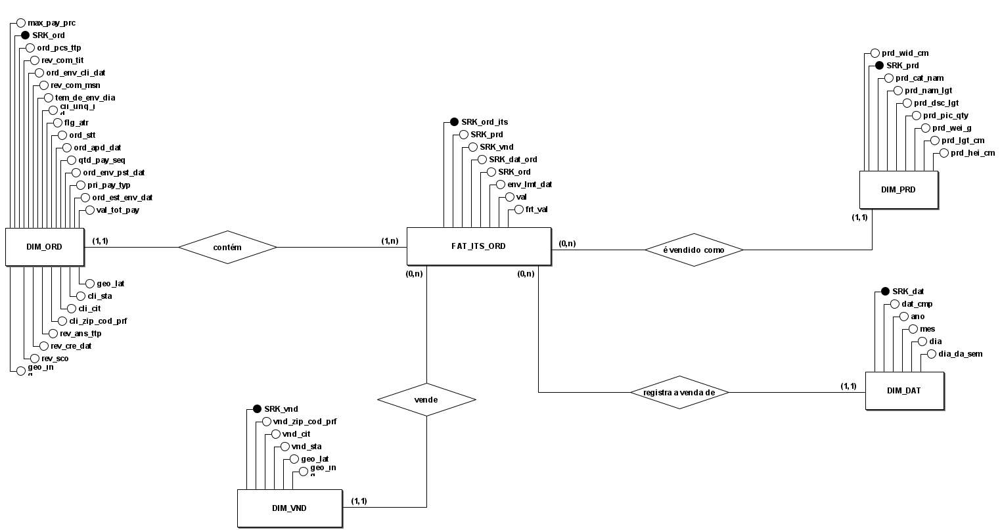
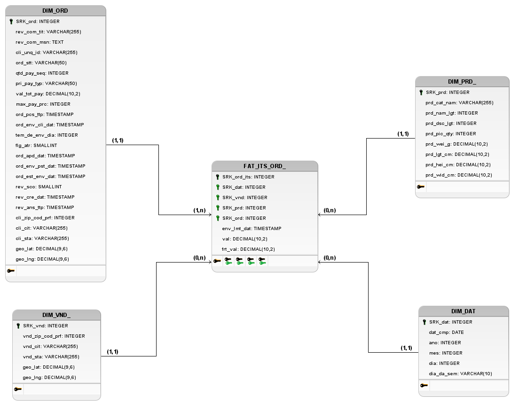

# Data Selection & Gold Modeling Description

A camada Gold consolida em um modelo dimensional otimizado a camada Silver. Este modelo é composto por uma tabela fato central (**FAT\_ITS\_ORD**) e suas dimensões descritivas. O objetivo é criar uma *Single Source of Truth* (fonte única da verdade) para as principais entidades de negócio, utilizando o **Star Schema**.

1.  **Fact Table**: O núcleo do modelo continua sendo a `FAT_ITS_ORD`, representando a venda de um item de produto dentro de um pedido. Ela contém métricas quantitativas e as chaves estrangeiras para as dimensões.

2.  **Dimension Tables**: As dimensões descrevem o contexto dos eventos da tabela fato.

      * `DIM_ORD`: Unifica informações dos pedidos, clientes, pagamentos e avaliações, incluindo dados de geolocalização do cliente.
      * `DIM_PRD`: Contém detalhes descritivos dos produtos.
      * `DIM_VND`: Reúne informações dos vendedores e suas localizações.
      * `DIM_DAT`: Dimensão temporal derivada de colunas de timestamp para análises temporais.

O **SRK (Surrogate Key)** é uma **chave substituta** usada em modelagens dimensionais para identificar de forma única cada registro de uma tabela, sem depender de chaves naturais oriundas das fontes transacionais. Diferente das chaves de negócio — que podem mudar, conter valores nulos ou se repetir entre sistemas — o SRK é gerado artificialmente (geralmente como um número sequencial) e serve exclusivamente para manter a integridade referencial e otimizar o desempenho das consultas em ambientes de Data Warehouse. Esse tipo de chave simplifica a manutenção histórica das dimensões, facilita a integração de múltiplas origens de dados e garante estabilidade na estrutura do modelo mesmo que os dados de origem passem por alterações.

-----

## MER - Modelo Entidade-Relacionamento

O Modelo Entidade-Relacionamento (MER) é uma abordagem conceitual utilizada no desenvolvimento de bancos de dados para representar entidades, seus atributos e os relacionamentos entre elas. Ele facilita a visualização da organização dos dados e da forma como as entidades interagem dentro do sistema de informações. O MER serve como a fundação conceitual para a criação dos Diagramas Entidade-Relacionamento (DER), que ilustram graficamente essa estrutura.

### Entidades

  * FAT\_ITS\_ORD (Fact)
  * DIM\_ORD (Dimension)
  * DIM\_PRD (Dimension)
  * DIM\_VND (Dimension)
  * DIM\_DAT (Dimension)

### Descrição das Entidades (Atributos)

**FAT\_ITS\_ORD**
(<ins>`SRK_ord_its`</ins>, `SRK_prd`, `SRK_vnd`, `SRK_dat_ord`, `SRK_ord`, `env_lmt_dat`, `val`, `frt_val`)

**DIM\_ORD**
(<ins>`SRK_ord`</ins>, `rev_com_tit`, `rev_com_msn`, `cli_unq_id`, `ord_stt`, `qtd_pay_seq`, `pri_pay_typ`, `val_tot_pay`, `max_pay_prc`, `ord_pcs_ttp`, `ord_env_cli_dat`, `tem_de_env_dia`, `flg_atr`, `ord_apd_dat`, `ord_env_pst_dat`, `ord_est_env_dat`, `rev_sco`, `rev_cre_dat`, `rev_ans_ttp`, `cli_zip_cod_prf`, `cli_cit`, `cli_sta`, `geo_lat`, `geo_lng`)

**DIM\_PRD**
(<ins>`SRK_prd`</ins>, `prd_cat_nam`, `prd_nam_lgt`, `prd_dsc_lgt`, `prd_pic_qty`, `prd_wei_g`, `prd_lgt_cm`, `prd_hei_cm`, `prd_wid_cm`)

**DIM\_VND**
(<ins>`SRK_vnd`</ins>, `vnd_zip_cod_prf`, `vnd_cit`, `vnd_sta`, `geo_lat`, `geo_lng`)

**DIM\_DAT**
(<ins>`SRK_dat`</ins>, `dat_cmp`, `ano`, `mes`, `dia`, `dia_da_sem`)

### Relacionamentos

  * **PEDIDO — contém — ITEM DE PEDIDO**

      * Um PEDIDO (`Dim_Ord`) pode conter um ou vários ITENS DE PEDIDO (`Fat_Its_Ord`), enquanto que um ITEM DE PEDIDO pertence a apenas um PEDIDO.
      * Cardinalidade: (1:n)

  * **PRODUTO — é vendido como — ITEM DE PEDIDO**

      * Um PRODUTO (`Dim_Prd`) pode ser vendido como nenhum ou vários ITENS DE PEDIDO (`Fat_Its_Ord`), enquanto que um ITEM DE PEDIDO refere-se a apenas um PRODUTO.
      * Cardinalidade: (1:n)

  * **VENDEDOR — vende — ITEM DE PEDIDO**

      * Um VENDEDOR (`Dim_Vnd`) pode vender nenhum ou vários ITENS DE PEDIDO (`Fat_Its_Ord`), enquanto que um ITEM DE PEDIDO é vendido por apenas um VENDEDOR.
      * Cardinalidade: (1:n)

  * **DATA — registra a venda de — ITEM DE PEDIDO**

      * Em uma DATA (`Dim_Dat`) podem ser registrados nenhum ou vários ITENS DE PEDIDO (`Fat_Its_Ord`), enquanto que um ITEM DE PEDIDO é registrado em apenas uma DATA.
      * Cardinalidade: (1:n)

## DER - Diagrama de Entidade e Relacionamento

O Diagrama Entidade-Relacionamento (DER) é uma representação visual empregada em projetos de bancos de dados. Ele ilustra as entidades (objetos), seus atributos (características) e os relacionamentos existentes entre elas. Nesse diagrama, as entidades são representadas por retângulos, os atributos por elipses, e as conexões entre entidades são feitas por linhas que indicam seus relacionamentos. O DER é uma ferramenta essencial para visualizar e planejar a estrutura do banco de dados antes da implementação, auxiliando na definição de como os dados serão armazenados e acessados.

---

## DLD - Diagrama Lógico de Dados

O Diagrama Lógico de Dados (DLD) é uma representação gráfica que descreve a estrutura lógica de um banco de dados. Ele mostra detalhes importantes, como os tipos de atributos de cada entidade, além das chaves estrangeiras e restrições, como as chaves únicas (unique key). O principal objetivo do DLD é fornecer uma visão clara e estruturada de como o banco de dados deve ser projetado. Em síntese, o DLD serve como um guia visual para a implementação eficaz do banco de dados.

---

## Dicionário de Dados

O Dicionário de Dados é uma ferramenta fundamental no gerenciamento de dados. Trata-se de um documento ou repositório que descreve de forma detalhada os elementos de um banco de dados, como tabelas, campos, relacionamentos e regras de negócios associadas. Esse dicionário funciona como uma fonte confiável de informações para desenvolvedores, analistas e outros envolvidos, assegurando que os dados sejam compreendidos e utilizados de maneira consistente em todo o sistema. Ele oferece dados essenciais sobre a estrutura e o significado das informações, facilitando a manutenção, a integração e o uso eficiente das informações dentro de uma organização.

-----

### Tabela `DIM_PRD` (Antiga Dim\_Produtos)

| Nome do Campo | Tipo de Dado | Descrição | Observações |
| :--- | :--- | :--- | :--- |
| `SRK_prd` | INTEGER | Identificador único (Surrogate Key) do produto. | **PK** |
| `prd_cat_nam` | VARCHAR(255) | Nome da categoria à qual o produto pertence. | |
| `prd_nam_lgt` | INTEGER | Número de caracteres no nome do produto. | |
| `prd_dsc_lgt` | INTEGER | Número de caracteres na descrição do produto. | |
| `prd_pic_qty` | INTEGER | Quantidade de fotos publicadas do produto. | |
| `prd_wei_g` | DECIMAL(10,2) | Peso do produto em gramas. | |
| `prd_lgt_cm` | DECIMAL(10,2) | Comprimento do produto em centímetros. | |
| `prd_hei_cm` | DECIMAL(10,2) | Altura do produto em centímetros. | |
| `prd_wid_cm` | DECIMAL(10,2) | Largura do produto em centímetros. | |

-----

### Tabela `DIM_VND` (Antiga Dim\_Vendedores)

| Nome do Campo | Tipo de Dado | Descrição | Observações |
| :--- | :--- | :--- | :--- |
| `SRK_vnd` | INTEGER | Identificador único (Surrogate Key) do vendedor. | **PK** |
| `vnd_zip_cod_prf` | INTEGER | Os 5 primeiros dígitos do CEP do vendedor. | |
| `vnd_cit` | VARCHAR(255) | Cidade do vendedor. | |
| `vnd_sta` | VARCHAR(255) | Estado (UF) do vendedor. | |
| `geo_lat` | DECIMAL(9,6) | Latitude da localização geográfica do vendedor. | |
| `geo_lng` | DECIMAL(9,6) | Longitude da localização geográfica do vendedor. | |

-----

### Tabela `DIM_DAT` (Antiga Dim\_Data)

Tabela de dimensão de tempo, usada para analisar dados em diferentes granularidades de data.

| Nome do Campo | Tipo de Dado | Descrição | Observações |
| :--- | :--- | :--- | :--- |
| `SRK_dat` | INTEGER | Identificador único (Surrogate Key) da data. | **PK** |
| `dat_cmp` | DATE | A data completa no formato AAAA-MM-DD. | |
| `ano` | INTEGER | Ano extraído da data completa. | |
| `mes` | INTEGER | Mês extraído da data completa (1 a 12). | |
| `dia` | INTEGER | Dia extraído da data completa (1 a 31). | |
| `dia_da_sem` | VARCHAR(10) | Nome do dia da semana (ex: 'Segunda-feira'). | |

-----

### Tabela `DIM_ORD` (Antiga Dim\_Pedidos)

| Nome do Campo | Tipo de Dado | Descrição | Observações |
| :--- | :--- | :--- | :--- |
| `SRK_ord` | INTEGER | Identificador único (Surrogate Key) do pedido. | **PK** |
| `rev_com_tit` | VARCHAR(255) | Título do comentário de avaliação do cliente. | |
| `rev_com_msn` | TEXT | Texto completo do comentário de avaliação. | |
| `cli_unq_id` | VARCHAR(255) | Identificador único para cada cliente. | **NOT NULL** |
| `ord_stt` | VARCHAR(50) | Status atual do pedido (ex: 'delivered', 'shipped'). | **NOT NULL** |
| `qtd_pay_seq` | INTEGER | Quantidade de métodos de pagamento usados no pedido. | |
| `pri_pay_typ` | VARCHAR(50) | O primeiro ou principal método de pagamento. | |
| `val_tot_pay` | DECIMAL(10,2) | Soma total paga pelo pedido. | |
| `max_pay_prc` | INTEGER | Número máximo de parcelas escolhido. | |
| `ord_pcs_ttp` | TIMESTAMP | Data e hora em que o pedido foi realizado. | **NOT NULL** |
| `ord_env_cli_dat` | TIMESTAMP | Data e hora em que o pedido foi entregue ao cliente. | |
| `tem_de_env_dia` | INTEGER | Número de dias entre a compra e a entrega. | |
| `flg_atr` | SMALLINT | Indicador de atraso (ex: 1 para sim, 0 para não). | |
| `ord_apd_dat` | TIMESTAMP | Data e hora da aprovação do pagamento. | |
| `ord_env_pst_dat` | TIMESTAMP | Data e hora em que o pedido foi postado na transportadora. | |
| `ord_est_env_dat` | TIMESTAMP | Data estimada de entrega informada no momento da compra. | |
| `rev_sco` | SMALLINT | Nota da avaliação do cliente (valor de 1 a 5). | |
| `rev_cre_dat` | TIMESTAMP | Data e hora em que a avaliação foi criada. | |
| `rev_ans_ttp` | TIMESTAMP | Data e hora em que o vendedor respondeu à avaliação. | |
| `cli_zip_cod_prf` | INTEGER | Os 5 primeiros dígitos do CEP do cliente. | |
| `cli_cit` | VARCHAR(255) | Cidade do cliente. | |
| `cli_sta` | VARCHAR(255) | Estado (UF) do cliente. | |
| `geo_lat` | DECIMAL(9,6) | Latitude da localização geográfica do cliente. | |
| `geo_lng` | DECIMAL(9,6) | Longitude da localização geográfica do cliente. | |

-----

### Tabela `FAT_ITS_ORD` (Antiga Fato\_Itens\_Pedido)

Tabela fato que conecta todas as dimensões e contém as principais métricas de negócio por item de pedido.

| Nome do Campo | Tipo de Dado | Descrição | Observações |
| :--- | :--- | :--- | :--- |
| `SRK_ord_its` | INTEGER | Identificador único (Surrogate Key) do item. | **PK** |
| `SRK_prd` | INTEGER | Ref. `DIM_PRD`. | **FK** |
| `SRK_vnd` | INTEGER | Ref. `DIM_VND`. | **FK** |
| `SRK_dat_ord` | INTEGER | Ref. `DIM_DAT`. | **FK** |
| `SRK_ord` | INTEGER | Ref. `DIM_ORD`. | **FK** |
| `env_lmt_dat` | TIMESTAMP | Data e hora limite para o vendedor postar o produto. | |
| `val` | DECIMAL(10,2) | Preço do produto (valor unitário). | **Métrica/Fato** |
| `frt_val` | DECIMAL(10,2) | Valor do frete para o item. | **Métrica/Fato** |

-----

## Bibliografia

OLIST. **Brazilian E-Commerce Public Dataset by Olist**. Plataforma Kaggle, 2018. Disponível em: [https://www.kaggle.com/datasets/olistbr/brazilian-ecommerce](https://www.kaggle.com/datasets/olistbr/brazilian-ecommerce). Acesso em: 5 out. 2025.

AIRBYTE. **Conceptual Data Model**. Airbyte, [s.d.]. Disponível em: [https://airbyte.com/data-engineering-resources/conceptual-data-model](https://airbyte.com/data-engineering-resources/conceptual-data-model). Acesso em: 5 out. 2025.

BANGASH, Fahad. **Building a Retail Data Warehouse: A Case Study in Star Schema Design**. Medium, [s.d.]. Disponível em: [https://medium.com/@bangashfahad98/building-a-retail-data-warehouse-a-case-study-in-star-schema-design-deea776dcd97](https://medium.com/@bangashfahad98/building-a-retail-data-warehouse-a-case-study-in-star-schema-design-deea776dcd97). Acesso em: 5 out. 2025.

DATABRICKS. **What is a medallion architecture?**. Databricks, [s.d.]. Disponível em: [https://www.databricks.com/glossary/medallion-architecture](https://www.databricks.com/glossary/medallion-architecture). Acesso em: 5 out. 2025.

DATABRICKS. **What is a star schema?**. Databricks, [s.d.]. Disponível em: [https://www.databricks.com/glossary/star-schema](https://www.databricks.com/glossary/star-schema). Acesso em: 5 out. 2025.

DREXEL UNIVERSITY. **Translation of Star Schema into Entity-Relationship Diagrams**. Drexel University CCI, [s.d.]. Disponível em: [https://cci.drexel.edu/faculty/song/publications/p\_DEXA97-Star.pdf](https://cci.drexel.edu/faculty/song/publications/p_DEXA97-Star.pdf). Acesso em: 5 out. 2025.

GASPARINI, Sarah Rylie. **Your Conceptual Guide to Building a Star Schema Data Warehouse**. Medium, [s.d.]. Disponível em: [https://medium.com/@sarahryliegasparini/your-conceptual-guide-to-building-a-star-schema-data-warehouse-3ea25ccf0fce](https://medium.com/@sarahryliegasparini/your-conceptual-guide-to-building-a-star-schema-data-warehouse-3ea25ccf0fce). Acesso em: 5 out. 2025.

GEEKSFORGEEKS. **Star Schema in Data Warehouse Modeling**. GeeksforGeeks, [s.d.]. Disponível em: [https://www.geeksforgeeks.org/dbms/star-schema-in-data-warehouse-modeling/](https://www.geeksforgeeks.org/dbms/star-schema-in-data-warehouse-modeling/). Acesso em: 5 out. 2025.

MICROSOFT. **Medallion architecture**. Microsoft Learn, 2025. Disponível em: [https://learn.microsoft.com/en-us/azure/databricks/lakehouse/medallion](https://learn.microsoft.com/en-us/azure/databricks/lakehouse/medallion). Acesso em: 5 out. 2025.

MICROSOFT. **Understand star schema and the importance for Power BI**. Microsoft Learn, [s.d.]. Disponível em: [https://learn.microsoft.com/en-us/power-bi/guidance/star-schema](https://learn.microsoft.com/en-us/power-bi/guidance/star-schema). Acesso em: 5 out. 2025.

MOTHERDUCK. **Star Schema Data Warehouse Guide**. MotherDuck, [s.d.]. Disponível em: [https://motherduck.com/learn-more/star-schema-data-warehouse-guide/](https://motherduck.com/learn-more/star-schema-data-warehouse-guide/). Acesso em: 5 out. 2025.

OWOX. **Star Schema Explained**. OWOX, [s.d.]. Disponível em: [https://www.owox.com/blog/articles/star-schema-explained](https://www.owox.com/blog/articles/star-schema-explained). Acesso em: 5 out. 2025.

Engenharia de Dados Academy. **Data Lakehouse para Dummies**. YouTube, [s.d.]. Disponível em: [https://www.youtube.com/watch?v=q33K4FWo0Lk](https://www.youtube.com/watch?v=q33K4FWo0Lk). Acesso em: 5 out. 2025.

VERTABELO. **What Is a Star Schema Data Model and Why Is It Important?**. Vertabelo, [s.d.]. Disponível em: [https://vertabelo.com/blog/star-chema-data-model/](https://vertabelo.com/blog/star-chema-data-model/). Acesso em: 5 out. 2025.

-----

## Histórico de Versão

| Versão | Data | Descrição | Autor |
| :--- | :--- | :--- | :--- |
| 1.0 | 06/10/2025 | Criação do documento | [Pablo S. Costa](https://github.com/pabloheika) |
| 1.1 | 11/11/2025 | Atualização de nomenclatura e mnemônicos (SRK, prod, vend), renomeia atributos | [Pablo S. Costa](https://github.com/pabloheika) |
| 1.2 | 28/11/2025 | Atualização de nomenclatura e atributos para uso de mnemônicos (padrão de 3 letras) no esquema Gold | [Pablo S. Costa](https://github.com/pabloheika) |