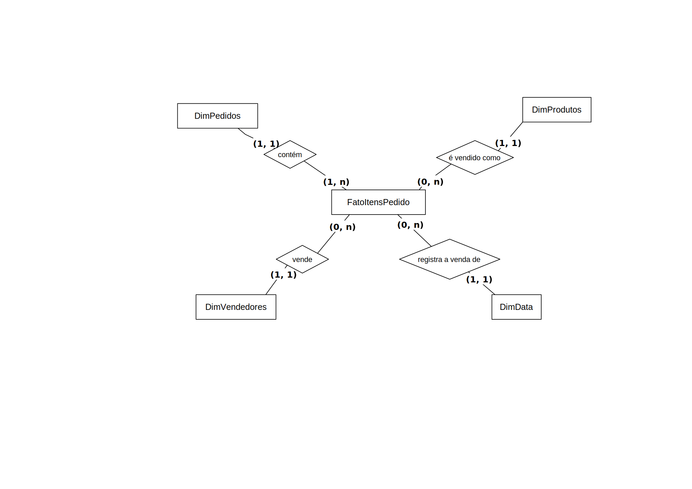
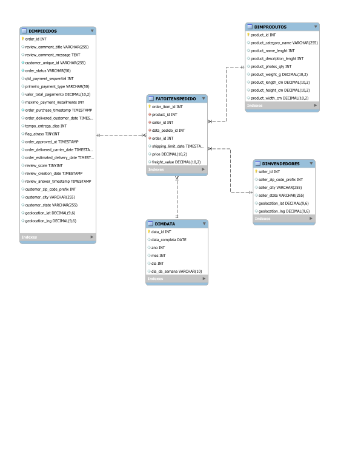

# Data Selection & Silver Modeling Description

A camada Silver irá consolidar e limpar os dados da camada Bronze, organizando-os em um modelo dimensional otimizado. Este modelo será composto por uma tabela fato central (FatoItensPedido) e suas dimensões descritivas. A modelagem visa criar uma "fonte única da verdade" (Single Source of Truth) para as principais entidades de negócio. Para isso nessa modelagem usamos o esquema em estrela. 

1. **Tabela Fato** (Fact Table): O núcleo do modelo continua sendo a FatoItensPedido, representando a venda de um item de produto dentro de um pedido. Ela conterá métricas quantitativas e as chaves estrangeiras para as dimensões.

2. **Tabelas de Dimensão** (Dimension Tables): As dimensões descreverão o contexto dos eventos da tabela fato.

   * DimPedidos: Agora unificará informações dos pedidos (orders), clientes (customers), pagamentos (payments) e avaliações (reviews). Além disso, os dados de geolocalização do cliente (geolocation) serão incorporados diretamente nesta tabela. Serão mantidos os campos calculados, como tempo de entrega e flag de atraso.
   * DimProdutos: Conterá os detalhes dos produtos (products).
   * DimVendedores: Agrupará as informações dos vendedores (sellers), agora enriquecidas com seus respectivos dados de geolocalização (geolocation).
   * DimData: Uma dimensão de data será criada a partir das colunas de timestamp para permitir análises temporais.

As transformações incluirão: limpeza de dados, enriquecimento (junção de tabelas, incluindo a desnormalização da geografia) e criação de métricas de negócio (cálculo de datas e flags).

## 1. MER - Modelo Entidade-Relacionamento

O Modelo Entidade-Relacionamento (MER) é uma abordagem conceitual utilizada no desenvolvimento de bancos de dados para representar entidades, seus atributos e os relacionamentos entre elas. Ele facilita a visualização da organização dos dados e da forma como as entidades interagem dentro do sistema de informações. O MER serve como a fundação conceitual para a criação dos Diagramas Entidade-Relacionamento (DER), que ilustram graficamente essa estrutura.

### 1.1. Entidades

* FATOITENSPEDIDO (Fact)
* DIMPEDIDOS (Dimension)
* DIMPRODUTOS (Dimension)
* DIMVENDEDORES (Dimension)
* DIMDATA (Dimension)

### 1.2. Descrição das Entidades (Atributos)

* **FATOITENSPEDIDO&#x20;**(order\_id, <ins>order\_item\_id</ins>, product\_id, seller\_id, data\_pedido\_id, shipping_limit_date, price, freight_value)

* **DIMPEDIDOS&#x20;**(<ins>order\_id</ins>, customer\_unique\_id, order_status, qtd_payment_sequential, primeiro_payment_type, valor\_total\_pagamento, maximo_payment_installments, order_purchase_timestamp, order_delivered_customer_date, tempo\_entrega\_dias, flag\_atraso, order_approved_at, order_delivered_carrier_date, order_estimated_delivery_date, review_score, review_comment_title, review_comment_message, review_creation_date, review_answer_timestamp, customer_zip_code_prefix, customer_city, customer_state, geolocation_lat, geolocation_lng)

* **DIMPRODUTOS&#x20;**(<ins>product\_id</ins>, product_category_name, product_name_lenght, product_description_lenght, product_photos_qty, product_weight_g, product_length_cm, product_height_cm, product_width_cm)

* **DIMVENDEDORES&#x20;**(<ins>seller\_id</ins>, seller_zip_code_prefix, seller_city, seller_state, geolocation_lat, geolocation_lng)

* **DIMDATA&#x20;**(<ins>data\_id</ins>, data\_completa, ano, mes, dia, dia\_da\_semana)

### 1.3. Relacionamentos

* **PEDIDO — contém — ITEM DE PEDIDO**
    * Um PEDIDO (`DimPedidos`) pode conter um ou vários ITENS DE PEDIDO (`FatoItensPedido`), enquanto que um ITEM DE PEDIDO pertence a apenas um PEDIDO.
    * Cardinalidade: (1:n)

* **PRODUTO — é vendido como — ITEM DE PEDIDO**
    * Um PRODUTO (`DimProdutos`) pode ser vendido como nenhum ou vários ITENS DE PEDIDO (`FatoItensPedido`), enquanto que um ITEM DE PEDIDO refere-se a apenas um PRODUTO.
    * Cardinalidade: (1:n)

* **VENDEDOR — vende — ITEM DE PEDIDO**
    * Um VENDEDOR (`DimVendedores`) pode vender nenhum ou vários ITENS DE PEDIDO (`FatoItensPedido`), enquanto que um ITEM DE PEDIDO é vendido por apenas um VENDEDOR.
    * Cardinalidade: (1:n)

* **DATA — registra a venda de — ITEM DE PEDIDO**
    * Em uma DATA (`DimData`) podem ser registrados nenhum ou vários ITENS DE PEDIDO (`FatoItensPedido`), enquanto que um ITEM DE PEDIDO é registrado em apenas uma DATA.
    * Cardinalidade: (1:n)

## 2. DER - Diagrama de Entidade e Relacionamento

O Diagrama Entidade-Relacionamento (DER) é uma representação visual empregada em projetos de bancos de dados. Ele ilustra as entidades (objetos), seus atributos (características) e os relacionamentos existentes entre elas. Nesse diagrama, as entidades são representadas por retângulos, os atributos por elipses, e as conexões entre entidades são feitas por linhas que indicam seus relacionamentos. O DER é uma ferramenta essencial para visualizar e planejar a estrutura do banco de dados antes da implementação, auxiliando na definição de como os dados serão armazenados e acessados.

## 3. DLD - Diagrama Lógico de Dados

O Diagrama Lógico de Dados (DLD) é uma representação gráfica que descreve a estrutura lógica de um banco de dados. Ele mostra detalhes importantes, como os tipos de atributos de cada entidade, além das chaves estrangeiras e restrições, como as chaves únicas (unique key). O principal objetivo do DLD é fornecer uma visão clara e estruturada de como o banco de dados deve ser projetado. Em síntese, o DLD serve como um guia visual para a implementação eficaz do banco de dados.

---

## Histórico de Versão

| Versão | Data       | Descrição            | Autor                                           |
| ------ | ---------- | -------------------- | ----------------------------------------------- |
| 1.0    | 06/10/2025 | Criação do documento | [Pablo S. Costa](https://github.com/pabloheika) |