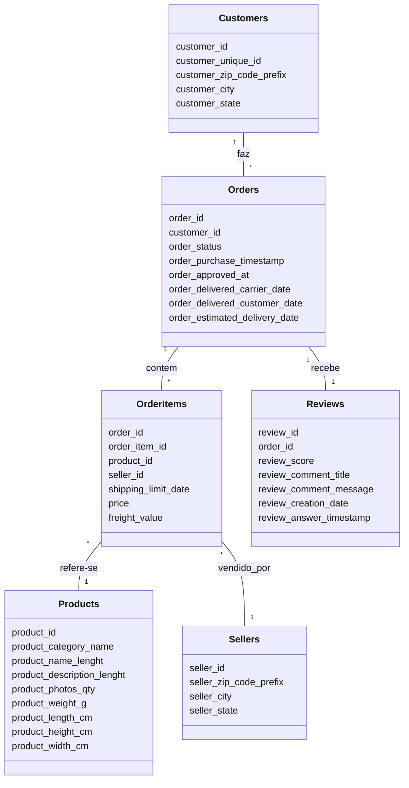

# Modelagem Silver - Olist E-commerce

## 1. MER - Modelo Entidade-Relacionamento

CUSTOMERS (1)---(N) ORDERS (1)---(N) ORDER_ITEMS (N)---(1) PRODUCTS
                                 |                  |
                                 |                  +--(N) SELLERS
                                 |
                                 +--(1) REVIEWS
```


---

## 2. DER - Diagrama de Entidade e Relacionamento

| Entidade      | Relacionamento           | Entidade Relacionada | Cardinalidade |
|---------------|-------------------------|----------------------|--------------|
| customers     | faz                     | orders               | 1:N          |

---

### DER - Mermaid JS


## 3. DLD - Diagrama Lógico de Dados

### Tabela: customers
| Campo                  | Tipo         | PK | FK |
|------------------------|--------------|----|----|
| customer_id            | VARCHAR(32)  | X  |    |
| customer_unique_id     | VARCHAR(32)  |    |    |
| customer_zip_code_prefix | INT        |    |    |
| customer_city          | VARCHAR(100) |    |    |
| customer_state         | CHAR(2)      |    |    |

### Tabela: orders
| Campo                        | Tipo         | PK | FK |
|------------------------------|--------------|----|----|
| order_id                     | VARCHAR(32)  | X  |    |
| customer_id                  | VARCHAR(32)  |    | X  |
| order_status                 | VARCHAR(20)  |    |    |
| order_purchase_timestamp     | TIMESTAMP    |    |    |
| order_approved_at            | TIMESTAMP    |    |    |
| order_delivered_carrier_date | TIMESTAMP    |    |    |
| order_delivered_customer_date| TIMESTAMP    |    |    |
| order_estimated_delivery_date| TIMESTAMP    |    |    |

### Tabela: order_items
| Campo              | Tipo         | PK | FK |
|--------------------|--------------|----|----|
| order_id           | VARCHAR(32)  | X  | X  |
| order_item_id      | INT          | X  |    |
| product_id         | VARCHAR(32)  |    | X  |
| seller_id          | VARCHAR(32)  |    | X  |
| shipping_limit_date| TIMESTAMP    |    |    |
| price              | DECIMAL(10,2)|    |    |
| freight_value      | DECIMAL(10,2)|    |    |

### Tabela: products
| Campo                    | Tipo         | PK | FK |
|--------------------------|--------------|----|----|
| product_id               | VARCHAR(32)  | X  |    |
| product_category_name    | VARCHAR(100) |    |    |
| product_name_lenght      | INT          |    |    |
| product_description_lenght| INT         |    |    |
| product_photos_qty       | INT          |    |    |
| product_weight_g         | INT          |    |    |
| product_length_cm        | INT          |    |    |
| product_height_cm        | INT          |    |    |
| product_width_cm         | INT          |    |    |

### Tabela: sellers
| Campo                  | Tipo         | PK | FK |
|------------------------|--------------|----|----|
| seller_id              | VARCHAR(32)  | X  |    |
| seller_zip_code_prefix | INT          |    |    |
| seller_city            | VARCHAR(100) |    |    |
| seller_state           | CHAR(2)      |    |    |

### Tabela: reviews
| Campo                   | Tipo         | PK | FK |
|-------------------------|--------------|----|----|
| review_id               | VARCHAR(32)  | X  |    |
| order_id                | VARCHAR(32)  |    | X  |
| review_score            | INT          |    |    |
| review_comment_title    | VARCHAR(100) |    |    |
| review_comment_message  | TEXT         |    |    |
| review_creation_date    | TIMESTAMP    |    |    |
| review_answer_timestamp | TIMESTAMP    |    |    |

---

> Diagrama textual para documentação e validação do modelo Silver.

